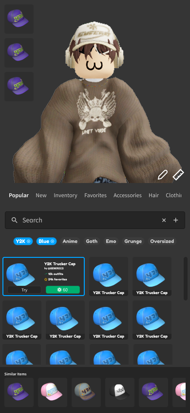
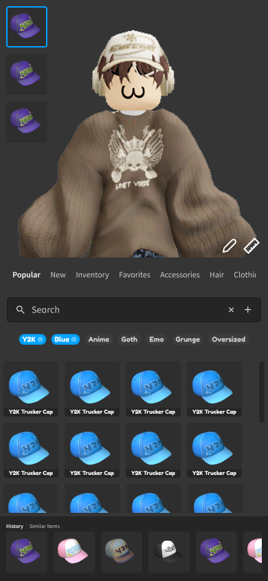
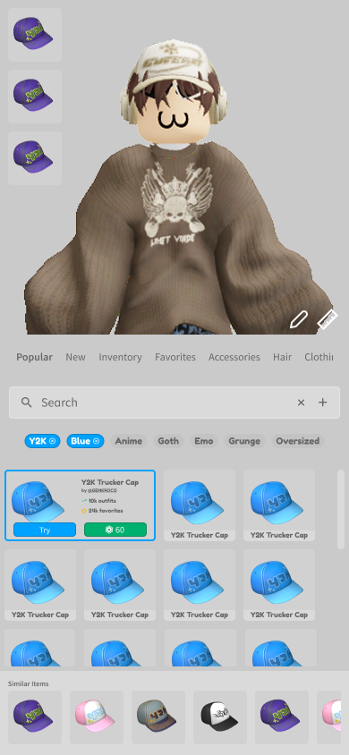
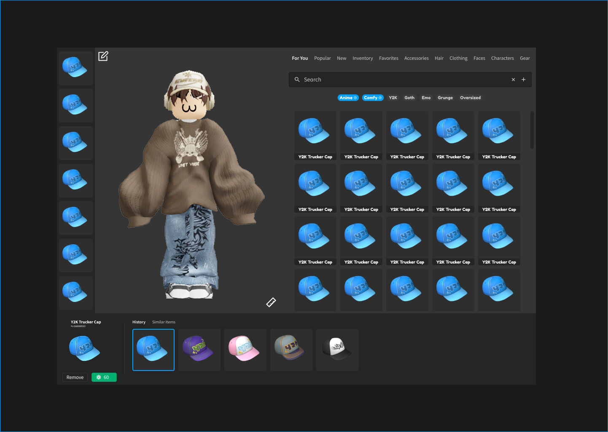
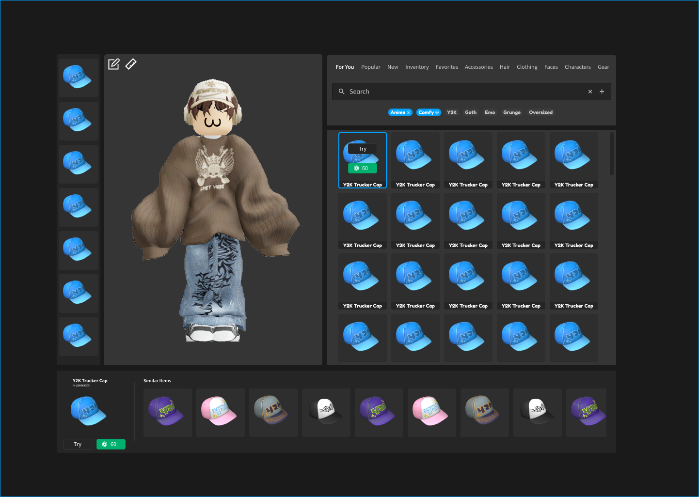
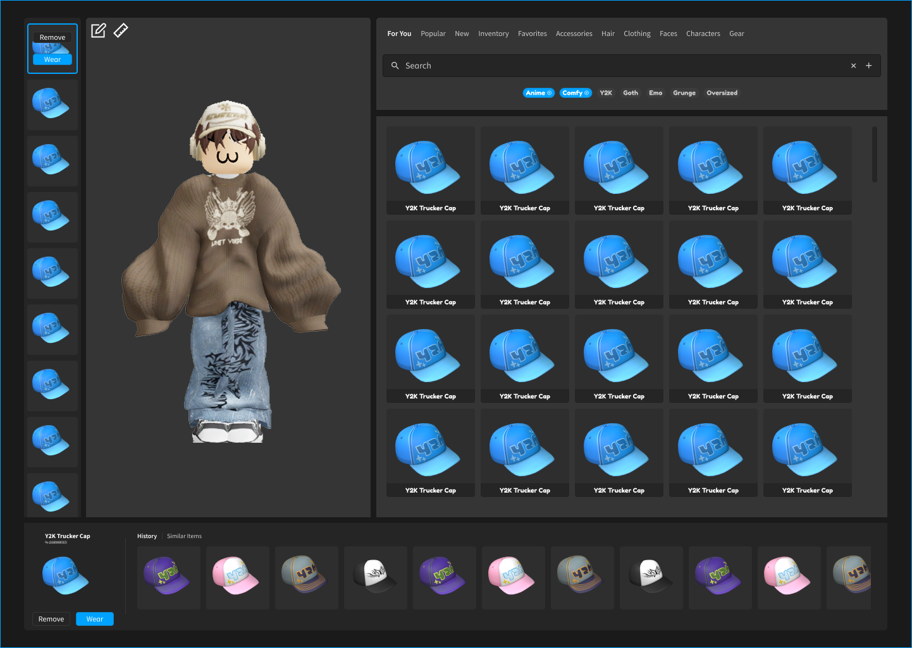

+++
date = '2023-01-01T00:00:00-00:00'
draft = true
title = 'Avatar Editor Mockup'
tags = ['Roblox', 'UI', 'React']
showTags = true
hidePagination = true
+++

Simple Figma mockups for one of several avatar editors I have been asked to create. I didn't end up implementing this one, in large part because flex layouts didn't exist at the time.

<!--more-->

## Mobile

## Desktop

