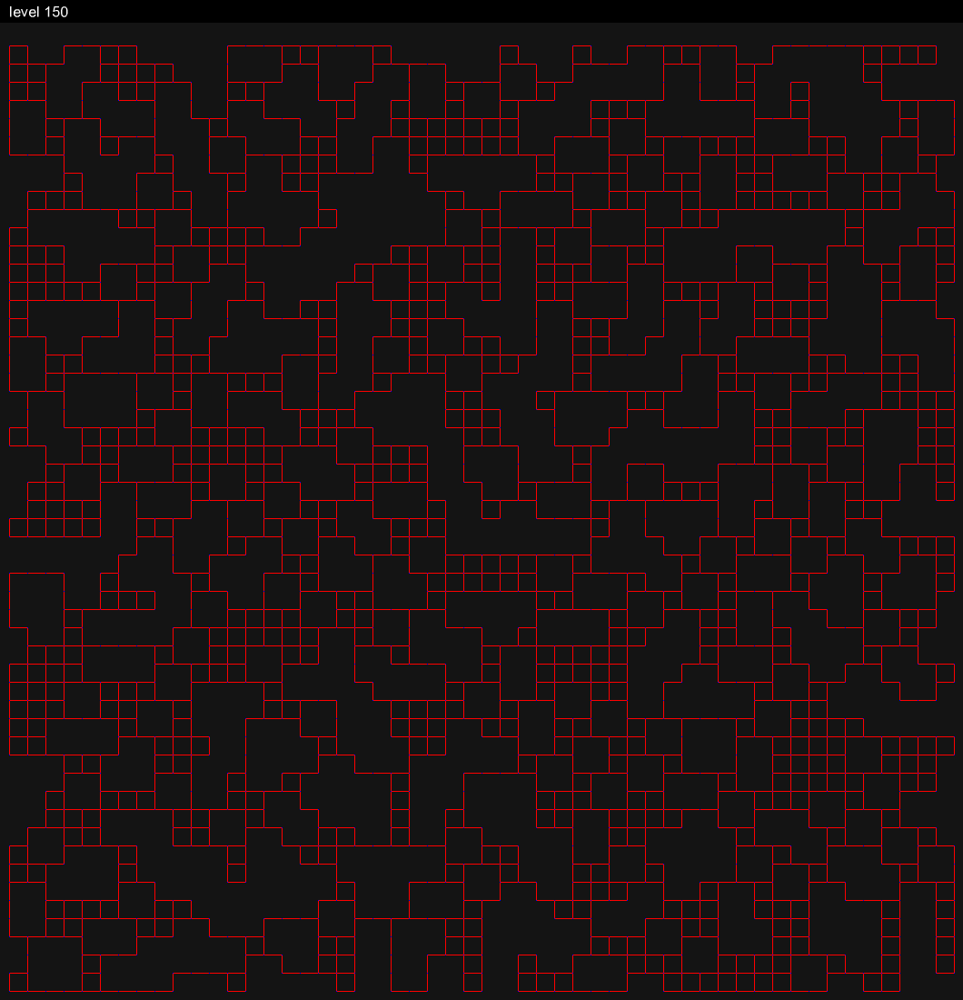
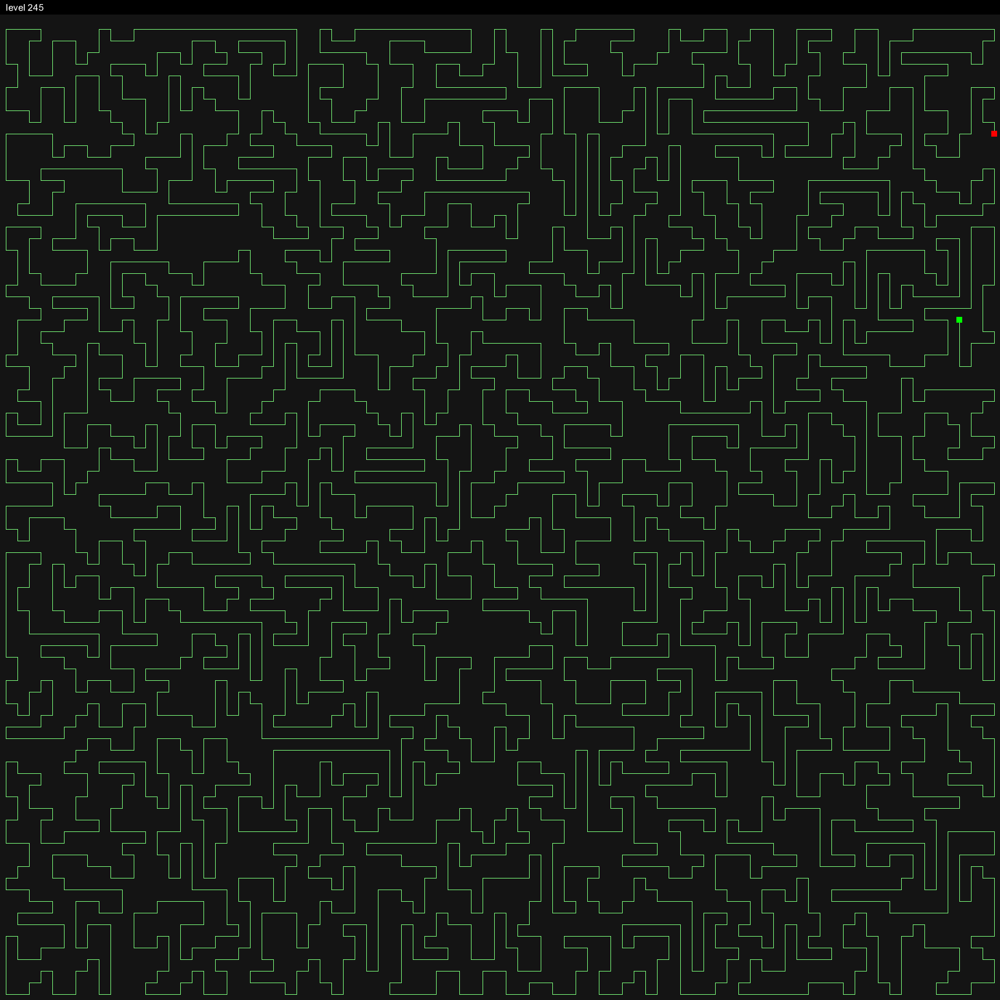

+++
date = '2025-01-01T00:00:00-00:00'
draft = false
title = 'Mortal Coil'
tags = ['Puzzle', 'Luau', 'Lune']
showTags = true
hidePagination = true
+++

[Mortal Coil](http://www.hacker.org/coil) is a puzzle game/programming challenge in which, given a grid with both open and closed spaces, the goal is to visit each open space once without crossing your path. You can start in any open space and move in any non-obstructed direction, but once you move, you must keep going in that direction until you hit an obstruction.

<!--more-->

In 2015, David Baszucki shared the challenge on Twitter, and it has haunted me since.
<blockquote class="twitter-tweet"><p lang="en" dir="ltr">Want a job at <a href="https://twitter.com/Roblox?ref_src=twsrc%5Etfw">@ROBLOX</a>? Go to <a href="https://t.co/tHSwDBq0NR">https://t.co/tHSwDBq0NR</a> get to level 1000+, tweet me a screenshot &amp; we&#39;ll fly you to <a href="https://twitter.com/hashtag/ROBLOX?src=hash&amp;ref_src=twsrc%5Etfw">#ROBLOX</a> for an interview.</p>&mdash; David Baszucki (@DavidBaszucki) <a href="https://twitter.com/DavidBaszucki/status/667173653574914050?ref_src=twsrc%5Etfw">November 19, 2015</a></blockquote> <script async src="https://platform.twitter.com/widgets.js" charset="utf-8"></script> 

I revisit the problem once a year, usually for a week or so in January following [Advent of Code](https://www.adventofcode.com). My solver, aptly named _Sisyphus_, is written in strictly typed Luau. I don't let it run for more than ten minutes at a time.

I suggest playing a few levels before reading on. 😌


## Naive Approach
The obvious place to start is with a simple brute force approach. For every open position, try moving in every available direction.

```luau
type Grid = {{number}} -- 0 is open, 1 is closed
type Move = {
	Position: Vector3,
	Path: {Vector3},
	Visited: {[Vector3]: boolean},
	OpenSpaces: number
}
type Result = {
	OK: boolean,
	Path: {Vector3}?
}

local OFFSETS = {Vector3.new(1, 0), Vector3.new(-1, 0), Vector3.new(0, 1), Vector3.new(0, -1)}

local grid = ...
local totalOpenSpaces = ...

local function solve(startPosition: Vector3): Result
	local stack: {Move} = {{
		Position = startPosition,
		Path = {startPosition},
		Visited = {
			[startPosition] = true	
		},
		OpenSpaces = totalOpenSpaces - 1
	}}
	
	while #stack > 0 do
		local move = table.remove(stack, #stack) -- Depth First Search
		if move == nil then break end
		
		if move.OpenSpaces == 0 then
			return {
				OK = true,
				Path = move.Path
			}
		end
		
		for _, offset in OFFSETS do
			local newPath = table.clone(move.Path)
			local newVisited = table.clone(move.Visited)
			local numMoves = 0
			
			local position = move.Position
			while true do
				local nextPosition = position + offset
				if move.Visited[nextPosition] then break end
				if nextPosition.Y > #grid or nextPosition.X > #grid[1] or nextPosition.Y < 1 or nextPosition.X < 1 then break end
				if grid[nextPosition.Y][nextPosition.X] == 1 then break end
				
				table.insert(newPath, nextPosition)
				newVisited[nextPosition] = true
				numMoves += 1
				position = nextPosition
			end
			
			if numMoves > 0 then
				table.insert(stack, {
					Position = position,
					Path = newPath,
					Visited = newVisited,
					OpenSpaces = move.OpenSpaces - numMoves
				})
			end
		end
	end
	
	return {
		OK = false
	}
end

for y = 1, #grid do
	for x = 1, #grid[1] do
		if grid[y][x] == 1 then continue end
		local result = solve(Vector3.new(x, y))
		if result.OK then
			submit(Vector3.new(x, y), result.Path)
		end
	end
end
```

This approach, however, will only make it through the first 40 levels or so before it sputters out. It uses a lot of memory copying and keeping track of tables, which can be remedied by switching to a simple backtracking approach instead (necessary on higher levels), but there is also a straight-forward heuristic which helps to reduce the number of iterations significantly.

## Counting Dead Ends
The complexity of the problem is determined primarily by the number of valid moves from any given board state and position, and it increases significantly every 50 levels or so. More intuitively, the longer it takes your solver to backtrack, to notice that it's travelling along a bad path, the longer it will take to finish a level. Basically: backtracking early is good.


_Complexity heatmap for each starting position on level 100, where red is more complex and green is most complex._

To stop going down bad paths early, the most effective heuristic is counting dead ends. You can only have one dead end: your end position. If by moving along you create two dead ends, then you have to backtrack. Importantly, you shouldn't consider the position in front of the coil to be a dead end because the coil can still pass through that position.

Some levels start with dead ends, which is useful because that dead end is either going to be your start position or your end position.

Incorporating dead ends into the example solver is pretty straightforward, though a little clunky. As the coil moves we now have to calculate the number of open neighbors for the open cells adjacent to the cell we have just travelled through. Ideally, you'd precalculate the number of open neighbors for each open cell, decrementing adjacent cells as the coil moves along. But with our naive approach, maintaining that state is too expensive memory-wise, and so it makes more sense to recalculate it as we go, though the time complexity is quite bad.

First, each move now has to track the number of dead ends.
```luau
type Move = {
	Position: Vector3,
	Path: {Vector3},
	Visited: {[Vector3]: boolean},
	OpenSpaces: number,
	DeadEnds: number
}
...
local stack: {Move} = {{
	Position = startPosition,
	Path = {startPosition},
	Visited = {
		[startPosition] = true	
	},
	OpenSpaces = totalOpenSpaces - 1,
	DeadEnds = 0 -- Assuming our grid doesn't start with a dead end
}}
```

As we iterate through our offsets, we should also keep track of the perpendicular offset.
```luau
for _, offset in OFFSETS do
	local perpendicularOffset = Vector3.new(-offset.Y, offset.X)
	...
	local deadends = 0
	...
end
```

Then, as the coil moves, for both cells perpendicular to our "old" position, we count the number of open neighboring cells, making sure to exclude any cells on our current path.
```luau
local perpendicularCells = {position + perpendicularOffset, position - perpendicularOffset}
-- for both perpendicular cells...
for _, perpendicularCell in perpendicularCells do
	if newVisited[perpendicularCell] then continue end
	if perpendicularCell.Y > #grid or perpendicularCell.X > #grid[1] or perpendicularCell.Y < 1 or perpendicularCell.X < 1 then continue end
	if grid[perpendicularCell.Y][perpendicularCell.X] == 1 then continue end
	-- if the perpendicular cell is valid...
	local openNeighbors = 0
	for _, offset in OFFSETS do
		local perpendicularNeighbor = perpendicularCell + offset
		if perpendicularNeighbor == position then continue end
		if newVisited[perpendicularNeighbor] then continue end
		if perpendicularNeighbor.Y > #grid or perpendicularNeighbor.X > #grid[1] or perpendicularNeighbor.Y < 1 or perpendicularNeighbor.X < 1 then continue end
		-- find each valid neighbor of that perpendicular cell
		if grid[perpendicularNeighbor.Y][perpendicularNeighbor.X] == 0 then
			openNeighbors += 1
		end
	end
	-- a cell is a dead end if it only has one open neighbor
	if openNeighbors <= 1 then
		deadends += 1
	end
end
```

And if there is more than one dead end, we give up on this path.
```luau
if move.DeadEnds + deadends > 1 then
	numMoves = 0
	break
end
```

The new solve function should look like this:
```luau
local function solve(startPosition: Vector3): Result
	local stack: {Move} = {{
		Position = startPosition,
		Path = {startPosition},
		Visited = {
			[startPosition] = true	
		},
		OpenSpaces = totalOpenSpaces - 1,
		DeadEnds = 0
	}}
	
	while #stack > 0 do
		local move = table.remove(stack, #stack)
		if move == nil then break end
		
		if move.OpenSpaces == 0 then
			return {
				OK = true,
				Path = move.Path
			}
		end
		
		for _, offset in OFFSETS do
			local perpendicularOffset = Vector3.new(-offset.Y, offset.X)
			
			local newPath = table.clone(move.Path)
			local newVisited = table.clone(move.Visited)
			local numMoves = 0
			
			local position = move.Position
			local deadends = 0
			
			while true do
				local nextPosition = position + offset
				if move.Visited[nextPosition] then break end
				if nextPosition.Y > #grid or nextPosition.X > #grid[1] or nextPosition.Y < 1 or nextPosition.X < 1 then break end
				if grid[nextPosition.Y][nextPosition.X] == 1 then break end
				
				local perpendicularCells = {position + perpendicularOffset, position - perpendicularOffset}
				-- for both perpendicular cells...
				for _, perpendicularCell in perpendicularCells do
					if newVisited[perpendicularCell] then continue end
					if perpendicularCell.Y > #grid or perpendicularCell.X > #grid[1] or perpendicularCell.Y < 1 or perpendicularCell.X < 1 then continue end
					if grid[perpendicularCell.Y][perpendicularCell.X] == 1 then continue end
					-- if the perpendicular cell is valid...
					local openNeighbors = 0
					for _, offset in OFFSETS do
						local perpendicularNeighbor = perpendicularCell + offset
						if perpendicularNeighbor == position then continue end
						if newVisited[perpendicularNeighbor] then continue end
						if perpendicularNeighbor.Y > #grid or perpendicularNeighbor.X > #grid[1] or perpendicularNeighbor.Y < 1 or perpendicularNeighbor.X < 1 then continue end
						-- find each valid neighbor of that perpendicular cell
						if grid[perpendicularNeighbor.Y][perpendicularNeighbor.X] == 0 then
							openNeighbors += 1
						end
					end
					-- a cell is a dead end if it only has one open neighbor
					if openNeighbors <= 1 then
						deadends += 1
					end
				end
				
				if move.DeadEnds + deadends > 1 then
					numMoves = 0
					break
				end
				
				table.insert(newPath, nextPosition)
				newVisited[nextPosition] = true
				numMoves += 1
				position = nextPosition
			end
			
			if numMoves > 0 then
				table.insert(stack, {
					Position = position,
					Path = newPath,
					Visited = newVisited,
					OpenSpaces = move.OpenSpaces - numMoves,
					DeadEnds = move.DeadEnds + deadends
				})
			end
		end
	end
	
	return {
		OK = false
	}
end
```

It's a mess! But it's easy to improve upon and it's already much faster. On level 30, for example, the solution time goes from ~1.5 seconds to ~500 milliseconds. (For reference it takes my solver less than 50 milliseconds 😎)

## Changing Data Structures
Up to this point I've used a two-dimensional array to represent the grid, but it helps long-term to treat it instead as a directed (sort of) planar graph.


_Level 150 represented as a planar graph where blue pixels are vertices and red segments are edges._

I use an [adjacency list](https://en.wikipedia.org/wiki/Adjacency_list) to represent the graph (with help from a hashmap). It's memory efficient and it makes looking up vertices, weights, and neighbors very fast.

It looks something like this:
```lua
local size = 0
local sizeEdges = 0

local graph: {{number}} = {}
local weights: {{string}} = {}
local values: {any} = {} -- Stores data associated with each cell (like its occupancy)

local weightsMap: {{[string]: number}} = {}

local function addVertex(value)
	size += 1
	table.insert(graph, {})
	table.insert(weights, {})
	table.insert(values, value)
end

local function directedEdge(a, b, weight)
	if table.find(graph[a], b) then return end

	table.insert(graph[a], b)

	if weight ~= nil then
		table.insert(weights[a], weight)
		weightsMap[a][weight] = b
	end

	if not table.find(graph[b], a) then
		sizeEdges += 1
	end
end

local function neighbor(vertex, weight)
	if weight ~= "UP" and weight ~= "DOWN" and weight ~= "LEFT" and weight ~= "RIGHT" and weight ~= "NONE" then return end

	local index = weightsMap[vertex][weight]
	return {
		Direction = weight,
		Cell = values[index],
		Position = index
	}
end

local function get(vertex)
	return values[vertex]
end

local function edges(vertex)
	return graph[vertex]
end
```

Looking at it this way also gives you, in my opinion, a better understanding of the actual structure of a level. It quickly becomes clear that many edges (and therefore entire segments) are essentially redundant, or can only be travelled through in one or two directions.

Hanging segments like the following, for example, can only reasonably be travelled through in one direction (unless your starting point lies within the segment), and so it makes sense to reduce segments like these directly on the graph.


_The edge "pointing downward" from vertex A can be modified to point directly to vertex B instead. Similarly, travelling rightward from vertex B will always cut off the graph (unless the start or end position is in that segment), so the edge facing right can be temporarily pruned from the graph._

Much of the graph on a level like 150 is made up of these larger segments that can be reduced into smaller segments, simplifying the problem space.

## Dynamic Connectivity
There is one more obvious heuristic...


_It is admittedly hard to tell what's going on here, but the coil head is the blue, and the start position is two spaces up and to the left (at 8, 9)._

If only I'd known earlier that I'd bifurcated the grid! 

In graph theory terms, this is a version of the [decremental dynamic connectivity problem](https://en.wikipedia.org/wiki/Dynamic_connectivity). Because our problem space is still ultimately a grid, the most obvious way of doing this is by performing a floodfill, but this is of course not reasonable to do for every move. There is a simple, _very_ elegant way of doing this, but I will leave it as an exercise to the reader so as not to _completely_ ruin the fun :)

## Conclusion
Unfortunately, in ten years of periodic prodding I've yet to reach level 1,000. I have, however, learned a lot. I've written versions of _Sisyphus_ in JavaScript, Rust, and of course Luau. I've become very familiar with algorithms like Breadth-First and Depth-First search, the differences between recursive and stack-based approaches; backtracking algorithms, optimization algorithms (a consequence of the odd tangent here and there), a decent though still narrow stretch of graph theory, &c. And I've had fun!


_Solution path for level 245._

I've also only implemented a minority of the ideas I've had over the years. There are several ways of reducing the search for the starting position I've yet to implement. I've also not bothered yet to implement a number of end-point conditions that I've noted down in however many txt files, spread across several different projects... The biggest idea I'd like to visit, though, is partitioning. It seems natural that given the way the graph seems to break up into distinct segments that it should also be possible to group these together to be solved individually and perhaps in parallel. Alas... maybe next year!