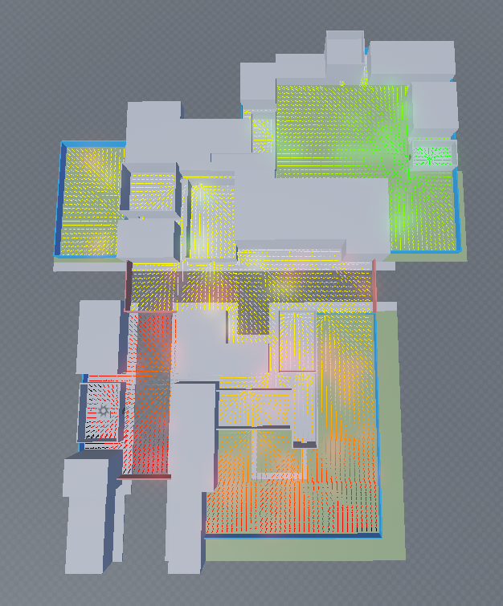

+++
date = '2023-09-14T00:00:00-00:00'
draft = false
title = 'Zombies'
tags = ['Roblox', 'ECS', 'Matter', 'React']
showTags = true
hidePagination = true
+++

Wrote the gameplay logic for an unrealized zombie game, including third-person over-the-shoulder weapons and zombie/NPC AI, utilizing Matter and React for gameplay and UI code respectively.

<!--more-->

I also wrote the round-system logic, which included dynamically spawning hordes, the option to revive teammates, and a win condition achievable by reaching the end of the map.

## Weapons


_Weapon assets and animations were sourced from Ruddev's open sourced Battle Royale. This is an earlier version without some of the animations._


_Melee weapons_



## Zombies & AI

Agents use a combination of Roblox's pathfinding service and context steering behavior to navigate. This applies to both zombies and allies. The map is dynamically separated into regions, and generic paths are calculated between regions via pathfinding service. Context steering behavior is robust enough for agents to navigate without getting stuck. Because the AI logic is simple, they use Finite State Machines to make decisions.

Agents are rendered locally and transform data is sent to each client several times per frame.


_The region logic doesn't apply here, but the paths are still only generated once for each horde as it's spawned in, and context steering is doing most of the work._


_Context steering demonstration. No pathfinding is involved._

_Flow field generated with pathfinding service on simple graybox level. Arrows transition from red to green the closer they are to the end position._